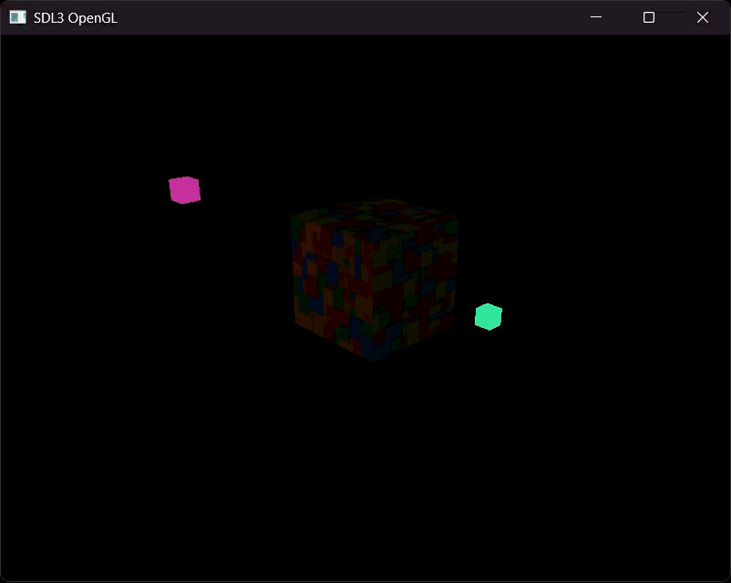

This project documents my progress while learning OpenGL using LearnOpenGL.

Current progress:
- Phong Shading Implementation

Next step:
- Implementing lights

Plans after learning fundamentals:
1. Build a small physics simulation
2. Create a small sandbox-style engine
